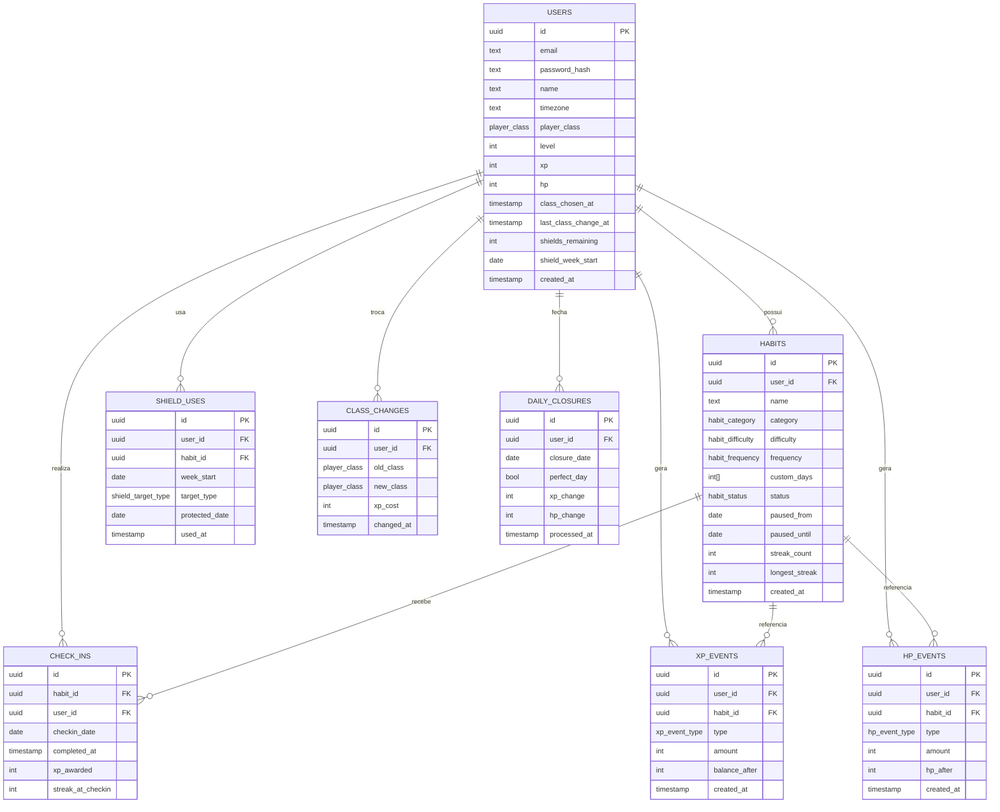

# Modelagem do Banco de Dados

Drizzle ORM. O schema implementa exatamente as regras de [01-regras-gamificacao.md](01-regras-gamificacao.md).

> **Nota (2026-08-09):** o projeto rodou em SQLite local (`better-sqlite3`) durante boa parte do desenvolvimento porque a máquina original não tinha Docker/Postgres — migrado para **Postgres** (`@neondatabase/serverless`, driver `neon-serverless` via `Pool`/WebSocket) para o deploy no Vercel, cujas funções serverless têm filesystem efêmero e não sobrevivem gravações em disco entre invocações. O schema em [db/schema.ts](../db/schema.ts) usa `pg-core` (enums continuam `text` com union type; `id` continua `text` com `crypto.randomUUID()` em vez de um tipo `uuid` nativo, pra minimizar a mudança; arrays/JSON viram `jsonb`). A migração de dialeto também obrigou a reescrever toda a camada de acesso a dados de síncrona (`better-sqlite3`) para assíncrona (`await`/`Promise`), já que todo `server/api/**` usava a API síncrona (`.get()`/`.run()`/`.all()`).

## Decisões de design

- **XP e HP atuais ficam no `users`** (colunas `xp`, `level`, `hp`) para leitura rápida do dashboard, mas toda mudança gera uma linha em `xp_events` / `hp_events` — os totais são cache, o ledger é a fonte da verdade e permite auditoria/gráfico de evolução.
- **Sub-evoluções de classe (Cavaleiro, Arcanista, Templário...) não são armazenadas.** São derivadas em runtime a partir de `player_class` + `level`, porque são 100% função desses dois valores (evita dado duplicado que pode ficar inconsistente).
- **`streak_count` fica cacheado em `habits`** (não recalculado a partir de `check_ins` toda vez) porque é lido em todo check-in para calcular o multiplicador de XP — recalcular via `COUNT`/`GROUP BY` a cada check-in seria caro.
- **`daily_closures`** existe para dar idempotência ao job noturno que fecha o dia por usuário (aplica punição de HP, bônus de dia perfeito) — sem isso, rodar o job duas vezes no mesmo dia duplicaria punições/bônus.

## Diagrama de entidades

## Tabelas

### `users`
Estado atual do jogador. `player_class` fica `null` enquanto for `Novato` (nível < 5).

### `habits`
Um hábito por linha. `custom_days` só é usado quando `frequency = dias_customizados` (array de 0–6, domingo a sábado). Pausa usa `paused_from`/`paused_until`; enquanto a data atual está nesse intervalo, o hábito é tratado como pausado nas regras da seção 6.

### `check_ins`
Um check-in por hábito por dia — `unique(habit_id, checkin_date)` impede check-in duplicado no mesmo dia. Guarda `xp_awarded` e `streak_at_checkin` como snapshot (o que foi calculado na hora), para que mudanças futuras na fórmula não reescrevam o histórico.

### `xp_events` / `hp_events`
Ledger append-only de toda variação de XP/HP, com o tipo do evento (`checkin`, `dia_perfeito`, `penalidade_recaida`, `custo_troca_classe`, `habito_nao_cumprido`, `regen_dia_perfeito`, `reset_recaida`, `escudo_usado`). `balance_after`/`hp_after` guardam o valor total após o evento, útil para gráfico de evolução sem precisar somar tudo toda vez.

### `shield_uses`
Um registro por uso de escudo. A regra "1 por semana" é garantida por índice único em `(user_id, week_start)` — a aplicação também zera/renova via `shields_remaining` em `users` a cada segunda-feira.

### `class_changes`
Log de auditoria de troca de classe (a cada 90 dias, custo de 30% do XP). Não é a fonte da verdade do multiplicador — isso é sempre `users.player_class` atual.

### `daily_closures`
Um registro por usuário por dia processado pelo job de fechamento (00:00 no fuso do usuário). `unique(user_id, closure_date)` garante idempotência caso o job rode mais de uma vez.

## Schema Drizzle

Ver [db/schema.ts](../db/schema.ts).
